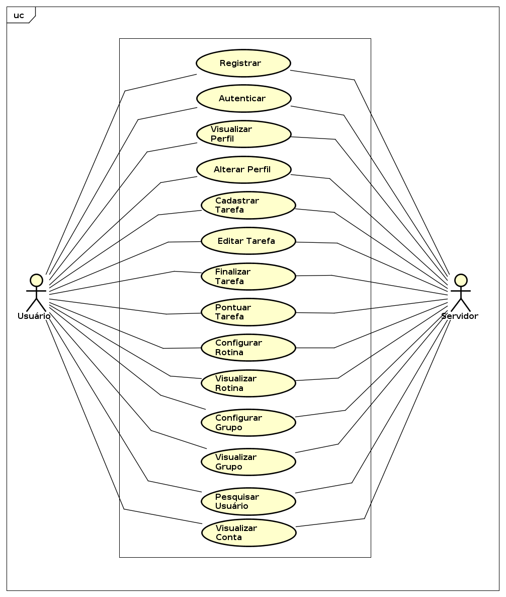

## Análise de Requisitos

### Diagrama dos Casos de Uso



### Descrição dos Casos de Uso

**1. Caso de Uso: Registrar Usuário**

- **Ator Primário:** Usuário

- **Ator Secundário:** Servidor

- **Requisito:** RF.01

- **Resumo:** Registrar USUÁRIO para acesso as funcionalidades do sistema

- **Fluxo principal:**

  ```
  1. Após instalação do aplicativo USUÁRIO acessa clicando no ícone;
  2. Sistema apresenta tela de login e USUÁRIO clica no botão Registrar-se;
  3. Sistema apresenta tela para que USUÁRIO preencha suas informações;
  4. USUÁRIO preenche as informações e clica no botão Registrar-se;
  5. Sistema executa validações dos campos (cpf, e-mail, datas, etc.);
  6. Sistema envia solicitação de registro para SERVIDOR;
  7. SERVIDOR verifica se não existe USUÁRIO com mesma identificação;
  8. SERVIDOR grava registro no Banco de dados e retorna resultado;
  9. Sistema confirma registro para o USUÁRIO e apresenta tela de Login.
  ```

- **Exceções:**
  
  - Se a validação dos campos no item 5 ou verificação do item 7 não ocorrer com sucesso, sistema apresenta resultado negativo para USUÁRIO e fluxo retorna para item 3.

***

**2. Caso de Uso: Autenticar Usuário**

* **Ator Primário:** Usuário

* **Ator Secundário:** Servidor

* **Requisito:** RF.01

* **Resumo:** Autenticação do USUÁRIO junto ao sistema

* **Fluxo principal:**

        1. USUÁRIO abre aplicativo clicando no ícone;
        2. Sistema apresenta tela para que USUÁRIO digite login e senha para autenticação;
        3. USUÁRIO digita login e senha e clica no botão Entrar;
        4. Sistema envia credenciais do USUÁRIO para o SERVIDOR autenticar;
        5. SERVIDOR retorna confirmação da autenticação para o sistema;
        6. Sistema apresenta tela principal para o USUÁRIO.

* **Exceções:**
  
  * Caso USUÁRIO digite de forma incorreta o login e/ou senha. Sistema exibe mensagem de erro para USUÁRIO e fluxo volta para item 2.

***

**3. Caso de Uso: Visualizar Perfil do Usuário** 

* **Ator Primário:** Usuário

* **Ator Secundário:** Servidor

* **Requisito:** RF.02

* **Resumo:** Visualização de perfil pelo USUÁRIO

* **Fluxo Principal:** 
  
        1. Na tela principal, USUÁRIO clica no menu e seleciona a opção perfil;
        2. Sistema envia o pedido das informações do perfil registrado para o SERVIDOR;
        3. SERVIDOR envia as informações sobre o perfil para o Sistema; 
        4. Sistema apresenta tela com as informações do perfil do usuário;
    

***

**4. Caso de Uso: Alterar dados do Perfil do Usuário**


* **Ator Primário:** Usuário

* **Ator Secundário:** Servidor

* **Requisito:** RF.02

* **Resumo:** Alterar informações cadastrais do USUÁRIO

* **Fluxo principal:**
  
        1. Na tela de perfil, USUÁRIO clica no menu do card com o perfil e seleciona a opção editar;
        2. Sistema apresenta tela de edição com informações possíveis de alterar;
        3. USUÁRIO altera informações desejadas e clica no ícone Salvar;
        4. Sistema executa validações dos campos alterados;
        5. Sistema envia solicitação de alteração para o SERVIDOR;
        6. SERVIDOR executa alteração no Banco de dados e retorna resultado;
        7. Sistema apresenta confirmação e retorna para tela de perfil do USUÁRIO ;
    
* **Exceções:**
  
  * Se a validação dos campos no item 4 não ocorrer com sucesso, sistema apresenta resultado negativo e fluxo retorna para item 2.
***


**5. Caso de Uso: Cadastrar Tarefa**

* **Ator Primário:** Usuário

* **Ator Secundário:** Servidor

* **Requisito:** RF.03

* **Resumo:** Cadastro de tarefa pelo USUÁRIO

* **Fluxo Principal:** 
  
        1. Na tela principal, USUÁRIO clica no botão flutuante Adicionar;
        2. Sistema apresenta tela de cadastro de tarefa;
        3. USUÁRIO preenche informações da tarefa e clica no ícone Salvar;
        4. Sistema executa validação dos campos;
        5. Sistema envia solicitação de cadastro de tarefa para o SERVIDOR;
        6. SERVIDOR executa gravação da tarefa no Banco de Dados e retorna resultado;
        7. Sistema apresenta confirmação e apresenta tela de informações da tarefa;
    
* **Exceções:**
  
  * Se a validação dos campos não ocorrer com sucesso ou gravação da tarefa no banco de dados retornar erro, sistema apresenta resultado negativo e fluxo retorna para item 2.

***

**6. Caso de Uso: Editar Tarefa**

* **Ator Primário:** Usuário

* **Ator Secundário:** Servidor

* **Requisito:** RF.03

* **Resumo:** Edição de tarefa pelo USUÁRIO

* **Fluxo Principal:** 
  
        1. Na tela principal, USUÁRIO clica no menu do card da tarefa que deseja e seleciona editar;
        2. Sistema apresenta tela de edição da tarefa com campos possíveis de alterar;
        3. USUÁRIO altera informações desejadas e clica em Salvar;
        4. Sistema executa validação dos campos;
        5. Sistema envia solicitação de alteração de tarefa para o SERVIDOR;
        6. SERVIDOR executa gravação da alteração no Banco de Dados e retorna resultado;
        7. Sistema apresenta confirmação e retorna para tela de informações da tarefa;
    
* **Exceções:**
  
  * Se a validação dos campos não ocorrer com sucesso ou gravação da tarefa no banco de dados retornar erro, sistema apresenta resultado negativo e fluxo retorna para item 2.

***
**7. Caso de Uso: Finalizar Tarefa**

* **Ator Primário:** Usuário

* **Ator Secundário:** Servidor

* **Requisito:** RF.03

* **Resumo:** Solicitação de exclusão/conclusão da tarefa pelo USUÁRIO

* **Fluxo Principal:** 
  
        1. Na tela principal, USUÁRIO clica no menu do card da tarefa que deseja e seleciona finalizar;
        2. Sistema solicita para USUÁRIO confirmação da finalização;
        3. USUÁRIO confirma finalização da tarefa;
        4. Sistema envia solicitação de finalização da tarefa para o SERVIDOR;
        5. SERVIDOR atualiza o estado da tarefa de "Aberta" para "Finalizada"; 
        6. Sistema volta para a tela principal.

***

**8. Caso de Uso: Pontuar Tarefa**

* **Ator Primário:** Usuário

* **Ator Secundário:** Servidor

* **Requisito:** RF.09

* **Resumo:** Pontuação de tarefa pelo USUÁRIO

* **Fluxo Principal:** 
  
        1. Na tela principal, o USUÁRIO seleciona a aba "Finalizadas";
        2. Sistema apresenta cards de tarefas finalizadas;
        3. USUÁRIO clica no menu do card da tarefa que deseja e seleciona a opção avaliar;
        4. Sistema apresenta tela com informações da tarefa para avaliação;
        5. USUÁRIO executa avaliação da tarefa, adiciona possíveis comentários e clica no ícone salvar;
        6. Sistema envia avaliação da tarefa para o SERVIDOR;
        7. SERVIDOR executa gravação da alteração no Banco de Dados e retorna resultado;
        8. Sistema apresenta confirmação e retorna para tela principal na aba de tarefas finalizadas;
    
* **Exceções:**
  
  * Se a gravação da tarefa no banco de dados retornar erro, sistema apresenta resultado negativo e fluxo retorna para item 4.

***
**9. Caso de Uso: Configurar Rotina**

* **Ator Primário:** Usuário

* **Ator Secundário:** Servidor

* **Requisito:** RF.04

* **Resumo:** Configuração de rotina pelo USUÁRIO

* **Fluxo Principal:** 
  
        1. Na tela principal, USUÁRIO clica no menu e seleciona a opção rotinas;
        2. Sistema apresenta tela com as rotinas que envolvem o usuário;
        3. USUÁRIO clica no botão flutuante adicionar;
        4. Sistema apresenta a tela de configuração da rotina;
        5. USUÁRIO configura a rotina e clica no ícone Salvar;
        6. Sistema faz uma validação inicial da configuração e envia a solicitação de criação da rotina para o SERVIDOR;        
        7. SERVIDOR valida as configurações recebidas e atualiza ou cria a rotina;
        8. SERVIDOR envia uma notificação de sucesso para o USUÁRIO; 
        9. Sistema retorna para a tela de rotinas.
    
* **Exceções:**
  
  * Se a validação dos campos no item 6 não tiver sucesso será evidenciado o campo com entrada inválida e o sistema continuará neste item.
  * Se a validação dos campos no item 7 não tiver sucesso será retornado uma mensagem de falha para o usuário e o sistema retornará para o item 4.
***

**10. Caso de Uso: Visualizar Rotina**

* **Ator Primário:** Usuário

* **Ator Secundário:** Servidor

* **Requisito:** RF.04

* **Resumo:** Visualização de rotina pelo USUÁRIO

* **Fluxo Principal:** 
  
        1. Na tela principal, USUÁRIO clica no menu e seleciona a opção rotinas;
        2. Sistema envia o pedido das rotinas registradas para o SERVIDOR;
        3. SERVIDOR envia as informações sobre as rotinas para o Sistema; 
        4. Sistema apresenta tela com cards das rotinas que envolvem o usuário;
        5. USUÁRIO clica no menu do card da rotina que deseja detalhes e seleciona visualizar;
        6. Sistema apresenta tela com as informações da rotina;
***

**11. Caso de Uso: Configurar Grupo/Residência**

* **Ator Primário:** Usuário

* **Ator Secundário:** Servidor

* **Requisito:** RF.06

* **Resumo:** Configuração de Grupo/Residência pelo USUÁRIO

* **Fluxo Principal:** 
  
        1. Na tela principal, USUÁRIO clica no menu e seleciona a opção Casa;
        2. Sistema apresenta tela com as possíveis configurações da Casa;
        3. USUÁRIO edita as configurações e clica em Salvar;
        4. Sistema faz uma validação inicial da configuração e envia as configurações para o SERVIDOR;        
        5. SERVIDOR valida as configurações recebidas e atualiza o registro da casa;
        6. SERVIDOR envia uma notificação de sucesso para o USUÁRIO;
        7. Sistema apresenta tela com as possíveis configurações da Casa;
    
* **Exceções:**
  
   * Se a validação dos campos no item 4 não tiver sucesso será evidenciado o campo com entrada inválida e o sistema continuará neste item.
***

**12. Caso de Uso: Visualizar Grupo/Residencia**

* **Ator Primário:** Usuário

* **Ator Secundário:** Servidor

* **Requisito:** RF.06

* **Resumo:** Visualização de Grupo/Residencia pelo USUÁRIO

* **Fluxo Principal:** 
  
        1. Na tela principal, USUÁRIO clica no menu e seleciona a opção Casa;
        2. Sistema faz um pedido das informações do Grupo/Residencia para o SERVIDOR;        
        3. SERVIDOR envia as informações do Grupo/Residencia;
        4. Sistema apresenta tela com as configurações da Casa;
***


**13. Caso de Uso: Pesquisar Usuário**

* **Ator Primário:** Usuário

* **Ator Secundário:** Servidor

* **Requisito:** RF.08

* **Resumo:** Pesquisar por perfis de outros usuários

* **Fluxo Principal:** 
  
        1. Na tela principal, USUÁRIO clica no menu e seleciona a opção perfil;
        2. Sistema apresenta tela com informações de perfil do USUÁRIO;
        3. USUÁRIO escreve o nome usuário no campo de pesquisa e clica no ícone Buscar;
        4. Sistema envia o nome do perfil solicitado para o servidor;
        5. Servidor faz uma consulta no banco de dados e retorna o resultado para o sistema;
        6. Sistema exibe tela com cards do(s) possível(is) perfil(s) encontrados;
    
* **Exceções:**
  
   * Se a consulta realizada pelo servidor não tiver resultados o sistema exibirá resultado negativo e o fluxo retornará para o item 2;

***
