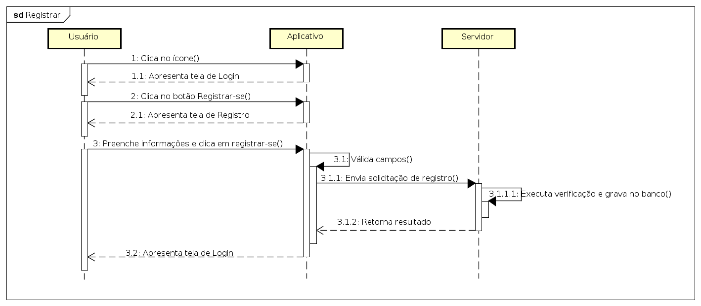
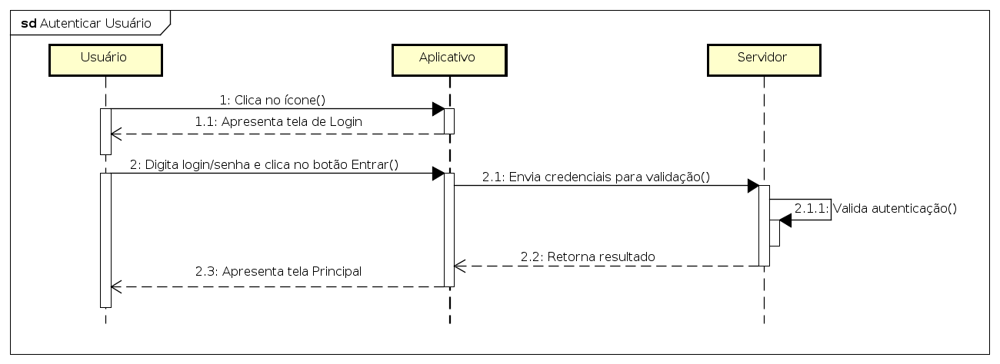
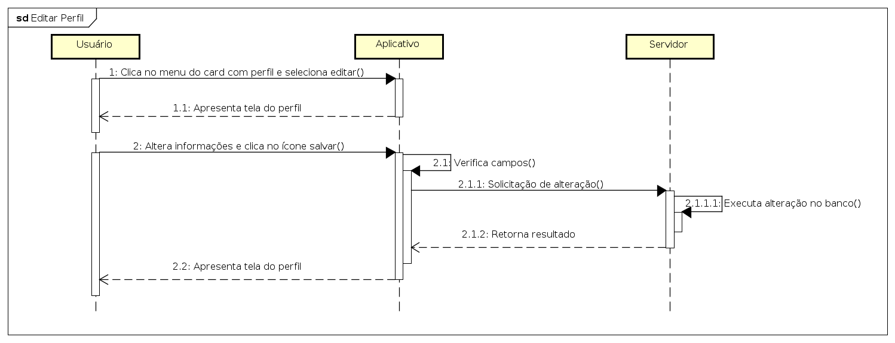

### Diagramas de Sequência dos Casos de Uso

**1. Caso de Uso: Registrar Usuário**

***

**2. Caso de Uso: Autenticar Usuário**

***

**3. Caso de Uso: Visualizar Perfil do Usuário** 

***

**4. Caso de Uso: Alterar dados do Perfil do Usuário**

***

**5. Caso de Uso: Cadastrar Tarefa**

***

**6. Caso de Uso: Editar Tarefa**

***

**7. Caso de Uso: Finalizar Tarefa**

***

**8. Caso de Uso: Pontuar Tarefa**

***

**9. Caso de Uso: Configurar Rotina**

***

**10. Caso de Uso: Visualizar Rotina**

***

**11. Caso de Uso: Configurar Grupo/Residência**

***

**12. Caso de Uso: Visualizar Grupo/Residencia**

***

**13. Caso de Uso: Pesquisar Usuário**

***
