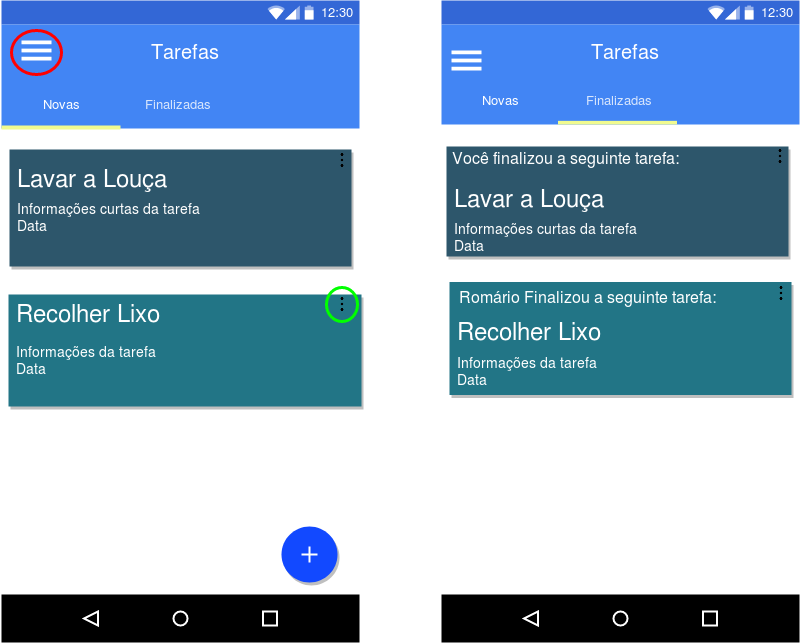
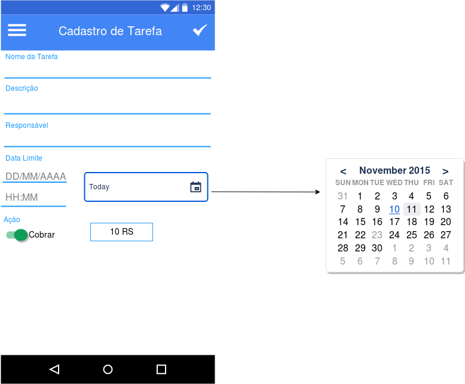
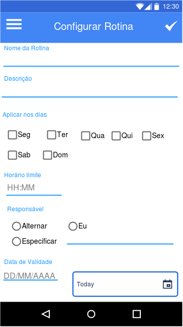

## Prototipagem das telas

### Telas do app

**1. Tela inicial:**

- **Login**


- **Registro**


**2. Tela principal:**

- **Tarefas abertas e finalizadas**



OBS.:
```diff
-O menu pode ser visualizado deslizando o dedo na tela ou clicando neste ícone.
+Clicando neste ícone a tela de editar tarefa e finalizar tarefa é exibida.
```

-**Criar tarefa**

Ao clicar no botão flutuante + exibido na tela anterior na aba 'aberta', esta tela é exibida.



**3. Menu:**


**4. Rotinas:**

- **Visualizar rotinas**


OBS.:
```diff
!Clicando neste ícone da rotina em específico a tela de configurar rotina é exibida (tela a seguir).
```

- **Configurar rotinas**

Ao clicar no botão flutuante + exibido na tela anterior esta tela é exibida.



**5. Perfil:**

- **Visualizar perfil**


- **Editar e visualizar perfil**

Ao clicar no ícone dos três pontos da tela anterior, a tela a seguir é exibida
E digitar um nome no campo 'buscar' da tela anterior a tela ao lado a seguir é exibida


